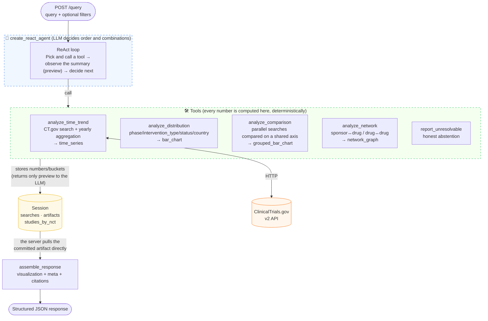
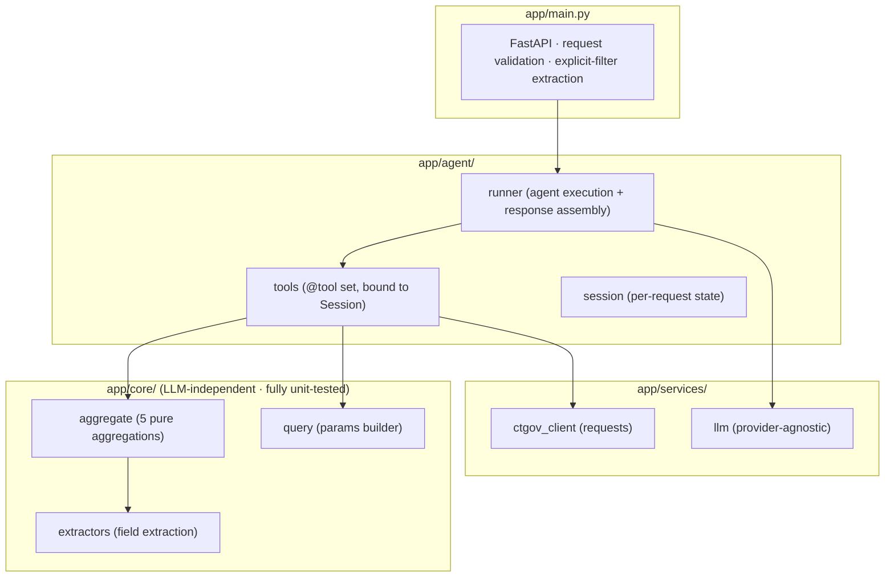

# System architecture

## 1. Constrained ReAct agent

The LLM only owns **tool orchestration** (choosing what to search and which aggregation
to combine). **Every number is computed by deterministic tools.** The final response is
assembled by the server straight out of Session artifacts — not from LLM text.

## 2. Why this shape — separating extensibility from safety

```mermaid
flowchart LR
    subgraph Judgment["🧠 What the LLM does (judgment / composition)"]
        A1["Parse the question → pick a tool"]
        A2["Decide search filters"]
        A3["Choose the aggregation axis / chart type / title"]
        A4["Compose multi-step flows (room to extend)"]
    end
    subgraph Compute["🛠 What the tools / core do (compute)"]
        B1["API query and pagination"]
        B2["group-by · count (every number)"]
        B3["network edges and weights"]
        B4["citation mapping"]
    end
    Judgment -->|"tool call"| Compute
    Compute -->|"artifact (real numbers)"| Store[("Session")]
    Store -->|"server assembles"| Out([Response])

    style Judgment fill:#f0f7ff,stroke:#3b82f6
    style Compute fill:#f5fff0,stroke:#22c55e
    style Store fill:#fef9e7,stroke:#eab308
```

> **Extensibility** comes from letting the LLM combine tools at runtime (new combinations
> and multi-hop flows without code changes), while **correctness/safety** comes from
> walling numbers off inside tools and assembling responses from artifacts.
> Because the two concerns are separated, the compute core (`app/core`) and its tests
> are unaffected when you swap out the orchestration.

## 3. Layer layout

**Design principle:** separate orchestration (`agent`) from compute (`core`). The first
iteration used a deterministic LangGraph; the orchestration was then replaced with a
ReAct agent to gain extensibility while the compute core and its tests were reused as-is.
