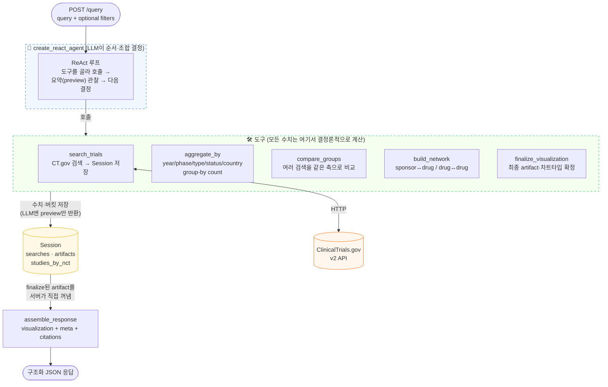
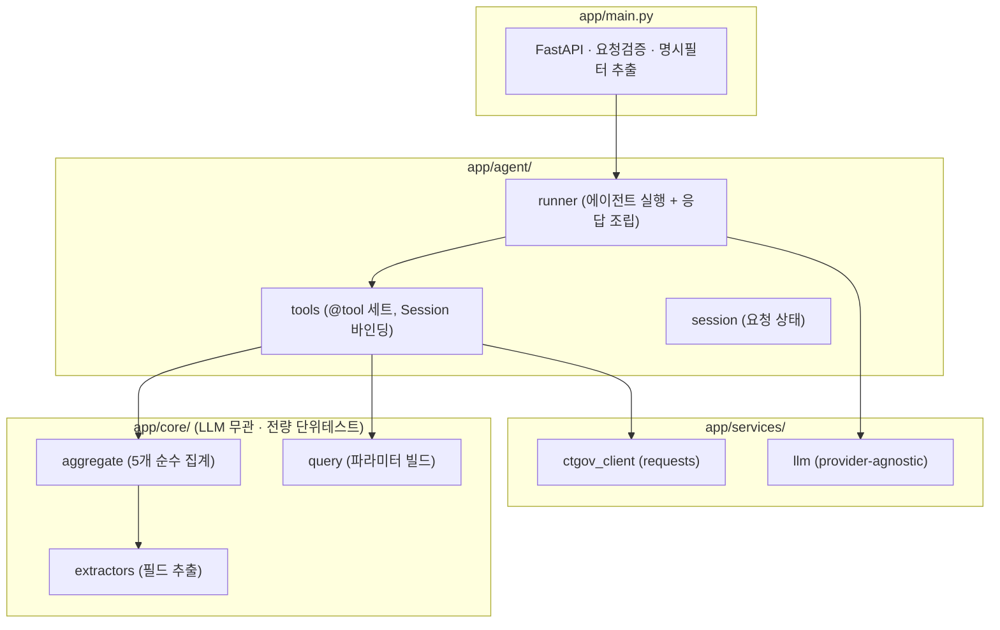

# 시스템 아키텍처

## 1. 통제된 ReAct 에이전트

LLM은 **도구 오케스트레이션**(어떤 검색을 하고 어떤 집계를 조합할지)만 담당하고,
**모든 수치는 결정론적 도구가 계산**한다. 최종 응답은 LLM 텍스트가 아니라 서버가 Session에
저장된 artifact에서 직접 조립한다.

## 2. 왜 이 구조인가 — 확장성과 안전성의 분리

```mermaid
flowchart LR
    subgraph Judgment["🧠 LLM이 하는 일 (판단·조합)"]
        A1["질문 해석 → 도구 선택"]
        A2["검색 필터 결정"]
        A3["집계 축·차트타입·제목 판단"]
        A4["멀티스텝 조합 (확장 여지)"]
    end
    subgraph Compute["🛠 도구/코어가 하는 일 (계산)"]
        B1["API 조회·페이징"]
        B2["group-by · count (모든 수치)"]
        B3["network 엣지·weight"]
        B4["citation 매핑"]
    end
    Judgment -->|"도구 호출"| Compute
    Compute -->|"artifact (실제 수치)"| Store[("Session")]
    Store -->|"서버가 조립"| Out([응답])

    style Judgment fill:#f0f7ff,stroke:#3b82f6
    style Compute fill:#f5fff0,stroke:#22c55e
    style Store fill:#fef9e7,stroke:#eab308
```

> **확장성**은 LLM의 런타임 도구 조합에서 얻고(새 조합·멀티홉을 코드 변경 없이),
> **정확성/안전성**은 수치를 도구에 가두고 응답을 artifact에서 조립해 얻는다.
> 두 관심사가 분리돼 있어, 오케스트레이션을 바꿔도 계산 코어(`app/core`)와 그 테스트는 불변이다.

## 3. 계층 구조

**설계 원칙:** 오케스트레이션(`agent`)과 계산(`core`)의 분리. 초기엔 결정론적 LangGraph로 구현했다가
확장성 관점을 반영해 ReAct 에이전트로 오케스트레이션만 교체했고, 계산 코어와 테스트는 그대로 재사용했다.
